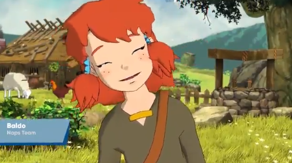
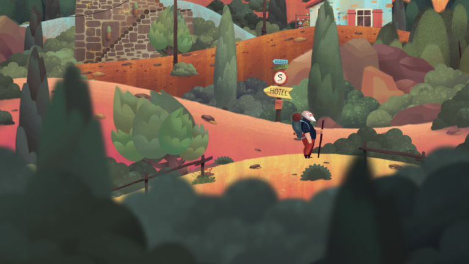

## JOGOS

- inside - docs https://github.com/playdeadgames/publications 

   

- the gardens between - http://www.thegardensbetween.com/

    

- firewatch

    

- Return of the Obra Dinn

   

- Subnautica

   
- Jenny Le Clue

   

- CocoVR

   

    link(https://www.youtube.com/watch?v=ud_eXl2ete8)

-Rick and Marty VR

Subnautica was announced by Unknown Worlds Entertainment on December 17, 2013,[3] with Charlie Cleveland as the game director and lead gameplay programmer, and Hugh Jeremy as the producer.[1]

- baldo

- 	Old Man's Journey

	Fe

	Florence
	Forgotton Anne
	Life is strange
	In The Valley of the Gods
	Ori and the Will 
	A Fold Apart 
	The Last Night
	Necrobarista
	Lost Words
	Sea of Solitude
	Monument Valley

The development team opted to use the Unity engine rather than Spark, the engine used for the company's previous game, Natural Selection 2. Subnautica producer Hugh Jeremy justified this decision because of the different demands that the game places on the engine, and "because [the team] does not include people working on Spark, it's not appropriate for Subnautica to use Spark. By using Unity for Subnautica, Spark can continue to develop in certain directions, while Subnautica develops in others. To use Spark for Subnautica would be like trying to fit a square peg in a round hole."[14]
#

Opinion alert: the graphical differences between various engines are negligible these days, and we are choosing the engine that is best in terms of workflow, cost, and flexibility. Unity seems like the clear winner there. We think it's worth sacrificing cutting edge graphics tech for all that.
- GTA SA map in unity

https://bitbucket.org/MukaSchultze/grand-theft-auto-for-unity/src