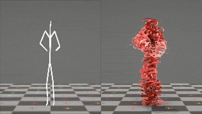

# myUnity

## Change between Scenes
 - [Ketos Games](https://www.youtube.com/watch?v=RlUEZjRUSt0)-Smooth Scene Transition Tutorial(video)
 - [youtube Brackeys](https://www.youtube.com/watch?v=0HwZQt94uHQ)How to Fade Between Scenes in Unity

## Mobile
 - [site](https://unity3d.com/learn/tutorials/topics/mobile-touch/building-your-unity-game-android-device-testing)Building your Unity game to an Android device for testing

## Docs

 - [scripting](https://unity3d.com/learn/tutorials/s/scripting) - unity site

## Entity Component System
 - [Entitas](https://github.com/sschmid/Entitas-CSharp)- Entitas is a super fast Entity Component System (ECS) Framework specifically made for C# and Unity
 - [BrokenBricksECS](https://github.com/Spy-Shifty/BrokenBricksECS) This ECS System is a rebuild of Unity3D upcoming Entity Component System. 
  - [Svelto](https://github.com/sebas77/Svelto.ECS)- Svelto ECS - Lightweight Entity Component System for Unity 

 ## C# job system
- [examples](https://github.com/stella3d/job-system-cookbook) - Examples of using the C# Job System in Unity 2018
 - [SimpleAnimation](https://github.com/Unity-Technologies/SimpleAnimation)A simple Animation Component that leverages PlayableGraphs [post](https://blogs.unity3d.com/2017/11/28/introducing-the-simple-animation-component/)
 
## Shaders
- keijiro/Swarm [github](https://github.com/keijiro/Swarm)An example of use of compute shaders and procedural instancing.
- ShaderGraphExamples[github](https://github.com/keijiro/ShaderGraphExamples)
- introduction-to-shader-graph [blog](https://blogs.unity3d.com/2018/02/27/introduction-to-shader-graph-build-your-shaders-with-a-visual-editor/)

## Funcional c#

- [video](https://www.youtube.com/watch?v=wJq86IXkFdQ)
- book [amazon](https://www.amazon.co.uk/Functional-Programming-C-Enrico-Buonanno/dp/1617293954/ref=sr_1_fkmr0_1?ie=UTF8&qid=1519648588&sr=8-1-fkmr0&keywords=functional+programming+in+c%23+enrico+bonanno)Functional Programming in C#
by Enrico Buonanno 

## Tutorials
- [reddit.com/r/unity_tutorials](https://www.reddit.com/r/unity_tutorials)

## PostProcessing

-keijiro/PostProcessingUtilities[github](https://github.com/keijiro/PostProcessingUtilities)

## 2D
-[light](https://www.youtube.com/watch?v=IjP2MeSozIs)

## Graphs
-[Procedural-Worlds-Editor](https://github.com/alelievr/Procedural-Worlds-Editor)
Main graph

Biome graph

## Animation

-keijiro/SkeletalGeometricEffects[github](https://github.com/keijiro/SkeletalGeometricEffects)

