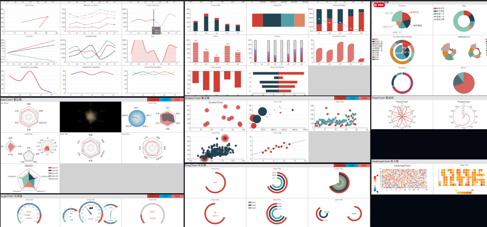
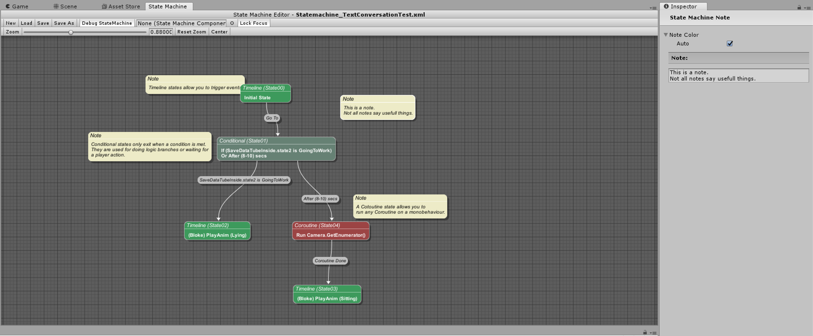

# myUnity

- GameDev[facebook](https://www.facebook.com/NeCGM.FEUP/)
- Best Practice Guide[unity](https://docs.unity3d.com/Manual/BestPracticeGuides.html)
- Unity for Humanity 2019 Challenge https://youtu.be/M7-Hk6-cGmY
## Change between Scenes
 - Spotlight Team Best Practices: GUID based references [blog](https://blogs.unity3d.com/2018/07/19/spotlight-team-best-practices-guid-based-references/)
 - [Ketos Games](https://www.youtube.com/watch?v=RlUEZjRUSt0)-Smooth Scene Transition Tutorial(video)
 - [youtube Brackeys](https://www.youtube.com/watch?v=0HwZQt94uHQ)How to Fade Between Scenes in Unity
 - uses timeline [video](https://www.youtube.com/watch?v=vOWEtSXjk2c)
 -  Screen Wipe for level loading / transitions in Unity3D - Using UGUI  [video]( https://www.youtube.com/watch?v=clN7JItftTE)
 
## Mobile
 - [site](https://unity3d.com/learn/tutorials/topics/mobile-touch/building-your-unity-game-android-device-testing)Building your Unity game to an Android device for testing

## Docs

 - [scripting](https://unity3d.com/learn/tutorials/s/scripting) - unity site

## Entity Component System
 - [Entitas](https://github.com/sschmid/Entitas-CSharp)- Entitas is a super fast Entity Component System (ECS) Framework specifically made for C# and Unity
  - [Svelto](https://github.com/sebas77/Svelto.ECS)- Svelto ECS - Lightweight Entity Component System for Unity  
  - [job-system-cookbook](https://github.com/stella3d/job-system-cookbook)
  - ECS Samples by Unity [EntityComponentSystemSamples](https://github.com/Unity-Technologies/EntityComponentSystemSamples)
  - ECS Doc by Unity [Documentation](https://github.com/Unity-Technologies/EntityComponentSystemSamples/blob/master/Documentation/index.md)
  - Survival Shooter using Unity’s Entity Component System (revisited)
  [post](https://medium.com/@gamevanilla/survival-shooter-using-unitys-entity-component-system-revisited-874cd69085ae) written by David Pol 
  
  - [keijiro/Voxelman](https://github.com/keijiro/Voxelman)
 
     
  
## scriptableobjects
 - Unite Austin 2017 - Game Architecture with Scriptable Objects
[[video]](https://www.youtube.com/watch?v=raQ3iHhE_Kk), 
[[github]](https://github.com/roboryantron/Unite2017), 
[[blogpost]](http://www.roboryantron.com/2017/10/unite-2017-game-architecture-with.html)
[[unity-blogpost]](https://unity3d.com/how-to/architect-with-scriptable-objects)
    

- SmartData [github](https://github.com/sigtrapgames/SmartData) implementacao da talk acima referida

    

 
 - outra implementacao https://github.com/NeoDragonCP/Unity-ScriptableObjects-Game-Events-
 [video](https://www.youtube.com/watch?v=1ZK63Mp6yTY)

 - Unite 2016 - Overthrowing the MonoBehaviour Tyranny in a Glorious Scriptable Object Revolution
[video](https://www.youtube.com/watch?v=6vmRwLYWNRo&t=6s)
   

Unity Scriptable Objects as Variables[video](https://www.youtube.com/watch?v=F5S2gq-30D8)

Unity Scriptable Objects as Enums [video](https://www.youtube.com/watch?v=zo2sxhv8GUk&t)

 ## Unity Events
 
 - UnityEvents Tutorial [video](https://www.youtube.com/watch?v=ju6mK6-e3Oo)
 
      
 - Actions - In this episode we look at how scripts can communicate with one another, either through a reference to the other script, or using events
 [video](https://www.youtube.com/watch?v=vDrYDAMdpuc&feature=youtu.be)
 
 - UnityEventVisualizer
[github]( https://github.com/MephestoKhaan/UnityEventVisualizer)
 
      

      

- [EventBus](https://github.com/SaldayOpen/EventBus)is a system, which could dispatch published events to any registered handler accepting particular event argument. This means, that your event sources should no longer contain references to other components, only to event bus.

 ## C# job system
- [examples](https://github.com/stella3d/job-system-cookbook) - Examples of using the C# Job System in Unity 2018
 - [SimpleAnimation](https://github.com/Unity-Technologies/SimpleAnimation)A simple Animation Component that leverages PlayableGraphs [post](https://blogs.unity3d.com/2017/11/28/introducing-the-simple-animation-component/)
 - [forum](https://forum.unity.com/threads/ecs-examples-for-inspiration.820614/) examples
 
## Shaders
- keijiro/Swarm [github](https://github.com/keijiro/Swarm)An example of use of compute shaders and procedural instancing.
- ShaderGraphExamples[github](https://github.com/keijiro/ShaderGraphExamples)
- introduction-to-shader-graph [blog](https://blogs.unity3d.com/2018/02/27/introduction-to-shader-graph-build-your-shaders-with-a-visual-editor/)

## Funcional c#

- [video](https://www.youtube.com/watch?v=wJq86IXkFdQ)
- book [amazon](https://www.amazon.co.uk/Functional-Programming-C-Enrico-Buonanno/dp/1617293954/ref=sr_1_fkmr0_1?ie=UTF8&qid=1519648588&sr=8-1-fkmr0&keywords=functional+programming+in+c%23+enrico+bonanno)Functional Programming in C#
by Enrico Buonanno 

## Framework

- [StratusFramework](https://github.com/Azurelol/StratusFramework)
In this repository you will find the source code to the Stratus Framework, a C# gameplay scripting framework for facilitating the composition of gameplay code for the Unity Engine. Its major tenet is to provide useful features with an easy to use interface while removing of as much boilerplate code from your scripts as possible.

- [Gameplay ingredients](https://github.com/peeweek/net.peeweek.gameplay-ingredients) - A collection of scripts that ease simple tasks while making games and prototypes.

## Tutorials

- [reddit.com/r/unity_tutorials](https://www.reddit.com/r/unity_tutorials)
- PlaygroundProject A collection of simple scripts to create 2D physics games[github](https://github.com/UnityTechnologies/PlaygroundProject)
- [GameEngineArchitectureSamples](https://github.com/Azurelol/GameEngineArchitectureSamples)

*Tips

- [How to Cope with Standard Unity FPS Controller](https://nothkedev.blogspot.com/2017/11/how-to-cope-with-standard-unity-fps.html)
- [procedurally-generated-meshes-in-unity](https://nothkedev.blogspot.com/2018/08/procedurally-generated-meshes-in-unity.html)
- Writing Shaders In Unity - Post Processing Shaders - Beginner Tutorial[video](https://www.youtube.com/watch?v=IRbWGI4Rqeo)
- Drag and Drop [video](https://www.youtube.com/watch?v=Pc8K_DVPgVM)
- click object [youtube](https://www.youtube.com/watch?v=RGjojuhuk_s)

## PostProcessing

- keijiro/PostProcessingUtilities[github](https://github.com/keijiro/PostProcessingUtilities)
- PostProcessing [wiki](https://github.com/Unity-Technologies/PostProcessing/wiki),[Quick-start](https://github.com/Unity-Technologies/PostProcessing/wiki/Quick-start)

## DXR
- HDRPRayTracingScenes - [github Unity](https://github.com/Unity-Technologies/HDRPRayTracingScenes)     

- https://github.com/sasa42/project-424-unity

## 2D
- [light 2D](https://www.youtube.com/watch?v=IjP2MeSozIs)
- 2D Animation    https://github.com/Unity-Technologies/2d-spriteshape-samples
   

- [Uncle Sam (Pt2) Spine 2D Animation Process](https://www.youtube.com/watch?v=L1JiNZvkZoI) - Exemplo como poderia utilizar o unity com animacao de vectores, embora so teria a estrutura de ossos.

	

 

## Graphs
- [Procedural-Worlds-Editor](https://github.com/alelievr/Procedural-Worlds-Editor) node based procedural terrain generator which aims to support a complex biome system, multiple surface generation algorithms and an easy and powerful API    
 

## Animation

- keijiro/SkeletalGeometricEffects[github](https://github.com/keijiro/SkeletalGeometricEffects)

## Unity tools
- [ShaderGraph](https://github.com/Unity-Technologies/ShaderGraph)

- Timeline 
  * Unite Austin 2017 - Bridging Gameplay and Storytelling in an RTS Game[video](https://www.youtube.com/watch?v=nn3SnfNNEmk)
[github](https://github.com/UnityTechnologies/ATerribleKingdom)
  * extending timeline. A practical guide[blog]https://blogs.unity3d.com/2018/09/05/extending-timeline-a-practical-guide/)
  * Animation Events (animation window -AINDA NAO IMPLEMENTADO NA TIMELINE - https://forum.unity.com/threads/timeline-events.479400/page-4)

  https://docs.unity3d.com/Manual/animeditor-AnimationEvents.html
- [animation.rigging](https://docs.unity3d.com/Packages/com.unity.animation.rigging@0.1/manual/index.html)   
  
 
 - RoadArchitect

 [video](https://www.youtube.com/watch?v=sS-qAdlID68&ab_channel=UGuruz)
 [github](https://github.com/FritzsHero/RoadArchitect)
 
- ProBuilder

- Animation-Sequencer     
[link](https://github.com/brunomikoski/Animation-Sequencer)      

- Highroad Engine : Arcade Racing solution for Unity

- Attribute Extensions for Unity https://github.com/dbrizov/NaughtyAttributes
- Tool for validating (ensuring no broken / missing outlets) objects like GameObjects, ScriptableObjects, etc, in the Unity Editor. https://github.com/DarrenTsung/DTValidator

ShaderGraph Property Renamer
Adds a new window accessible in the menu Tools>ShaderGraph Property renamer This tool allows the user to change reference names and display name of shader graph properties.
https://github.com/JulienHeijmans/ShaderGraphPropertyRenamer

## Examples
 
- robot Arm [github-demo](https://github.com/Unity-Technologies/articulations-robot-demo)
 

 - [Unity-Robotics-Hub](https://github.com/Unity-Technologies/Unity-Robotics-Hub)
  

- [DOTS-training-samples](https://github.com/Unity-Technologies/DOTS-training-samples)   
   

- [Project Tiny Samples](https://github.com/Unity-Technologies/ProjectTinySamples)   
 

- [flutter unity.uiwidgets](https://github.com/Unity-Technologies/com.unity.uiwidgets) UIWidgets is a plugin package for Unity Editor which helps developers to create, debug and deploy efficient, cross-platform Apps using the Unity Engine.
    

- [FigmaToUnityImporter](https://github.com/ManakhovN/FigmaToUnityImporter)  -Tool that imports nodes from Figma into the Unity 
   

- https://github.com/Unity-Technologies/com.unity.perception    

- [unity-ugui-XCharts](https://github.com/monitor1394/unity-ugui-XCharts)

- https://github.com/Yecats/UnityBehaviorTreeVisualizer

## Live Programming

- [keijiro/Beta](https://github.com/keijiro/Beta)   

- [keijiro/LASP](https://github.com/keijiro/Lasp)     

- [connect an Intel RealSense ](https://github.com/keijiro/Rsvfx) -depth camera to a Unity Visual Effect Graph.

---

# Tools

- [Materialize](http://www.boundingboxsoftware.com/materialize/index.php) - Free Texture Map Generation Tool

- [UnityFramework](https://github.com/traggett/UnityFramework) Framework for Unity that includes
 -Lots of useful utility classes.
 -Simple but powerful Event based Statemachine system with editor.
 -Localisation system
 -Fast and powerful NodeGraph system with editor.    
 Statemachine Editor

- [Console](https://github.com/peeweek/Console) -
A console for use in Unity Projects. The goal is to keep it as simple as possible. The console can register console commands to extend its possibilities. Console commands are easy to write and implement. There are some examples shipped with the base package.

- [UnityIngameDebugConsole](https://github.com/yasirkula/)This asset helps you see debug messages (logs, warnings, errors, exceptions) runtime in a build (also assertions in editor) and execute commands using its built-in console. It also supports logging logcat messages to the console on Android platform.UnityIngameDebugConsole
- 
- [Mapbox unity-sdk](https://www.mapbox.com/unity-sdk)
The Maps SDK for Unity is a collection of tools for building Unity applications from real map data. It enables Unity developers to interact with Mapbox web services APIs (including the Maps, Geocoding and Directions APIs) and create game objects via a C#-based API and graphical user interface.

 - https://github.com/Whinarn/UnityMeshSimplifier

---
- For blender unity exporter add-on  rotation-fix
   - https://forum.unity.com/threads/blender-unity-rotation-fix.181870/

- Blender export Fix Scale - if you choose FBX and wonder why the scale is always off, you have to change one thing in the Export window to fix it. 

 - Apply Scaling - From "All Local" to "FBX All" 
- 
---

# Visual scripting
- using_Playmaker_in_Production[link](https://www.gamasutra.com/blogs/YankoOliveira/20180205/314233/Haruspicy_and_Canopic_Jars_using_Playmaker_in_Production.php)

- FlowCanvas
  
 
 
  
  

Old
- [unity-shell](https://github.com/marijnz/unity-shell)  
  A console for use in Unity Projects -The goal is to keep it as simple as possible. The console can register console commands to extend its possibilities. Console commands are easy to write and implement. 
There are some examples shipped with the base package.

- [unishell](https://github.com/rje/unishell) Interactive C# Shell for the Unity3d editor 
----
## Raymarching
A Unity add-on for editing raymarched scenes live
In raymarching, a scene is made out of a series of algorithms and mathematical operations.

With raymarching you can do amazing things, like blend objects together or repeat them infinitely.

https://kev.town/raymarching-toolkit/

Raymarching Shader Generator in Unity
https://github.com/hecomi/uRaymarching
https://github.com/hecomi/uRaymarchingExamples

-----
### JSON
-----
https://github.com/SaladLab/Json.Net.Unity3D

### uniRX - Reactive Extensions for Unity 
-Reactive Extensions for Unity [github](https://github.com/neuecc/UniRx)
-UniRxSimpleGame - A simple game showing how to use UniRx to make a dumb endless game for Unity [github](https://github.com/Xerios/UniRxSimpleGame)

### UI Prototype
-Prototyping UI in Unity Part 3 — Introduction to UI Components 
-code https://github.com/marianomike/unity-prototype-photoapp

A simple wrapper around Unity's new experimental Vector API, letting you draw as if you were inside a HTML5 canvas. Demonstrates basic fills, strokes and fill rules.[unity-vg-demo](https://github.com/poke1024/unity-vg-demo)

### [ Scene Track](https://edfilms.net/en/scene-track-game-media-exporter/): Game Media Exporter Open Source
Scene Track: Game Media Exporter is an open source animation tool that delivers four kinds of data from Unity. By recording real-time gameplay, artists can now get video, image, MIDI and FBX files. Play. Record. Export. It's that easy. You don't need to know code. Jump in and try. It'll blow your mind!
 - presentation [video](https://www.youtube.com/watch?v=1pkprLEIIMk).
 - [demo-tutorial](https://www.youtube.com/watch?v=G_KMsYsoRg4).
 - Daniel Gies (E*D films) [autor chanel](https://www.youtube.com/channel/UCZD0nBcORFRo8QPxDbb4KDg)

---

# Shaders

- https://github.com/ChiliMilk/URP_Toon
  

- https://github.com/Unity-Technologies/com.unity.toonshader
   

---
# Links

- [Filament "Docs"](https://google.github.io/filament/Filament.md.html) is exceedingly well documented and is a great read for anyone working on a renderer, even if you have little interest in using Filament in your own projec

- http://tsubakit1.hateblo.jp/  blog japones

- https://github.com/SoylentGraham/PopUnityCommon - Collection of independent & useful unity scripts - submodule this under /Assets/ in your project

- http://unitylist.com

- https://connect.unity.com/

 - https://github.com/UnityCommunity/AwesomeUnityCommunity
