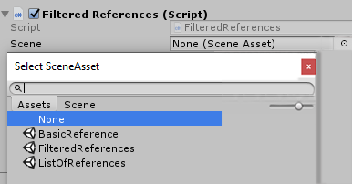
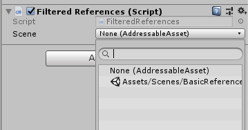
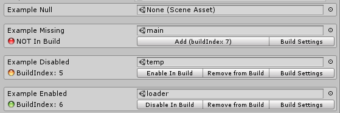

# Scenes


- Para listar scene assets do projecto          

- 


```cs
    public SceneAsset _scene;
```

- mas se quiser-mos filtrar so as scene que estao no AddressableAssets


```cs

    [Serializable]
    public class AssetReferenceScene : AssetReferenceT<SceneAsset>
    {
        public AssetReferenceScene(string guid) : base(guid) { }
    }

    public AssetReferenceScene leftObject2;
```
Baseado no exemplo 
Addressables-Sample\Basic\Basic AssetReference\FilteredReferences


O outro problema que temos e que nao corre como aplicacao porque os SceneAssets so estao disponiveis no editor entao temos que usar 


```cs    
    #if Editor 
```
Basear a solucao em:

https://answers.unity.com/questions/605184/scene-as-a-variable.html
https://gist.github.com/JohannesMP/ec7d3f0bcf167dab3d0d3bb480e0e07b




slides scene managment
https://docs.google.com/presentation/d/1BwtGa7rKBGatVHKdXVqYR6OseMsTflxCv4WHYHU9RxY/edit#slide=id.p
https://github.com/pfarnach/unity-scene-management-demo


Scene Manager in Unity (Unity Tutorial) LOADING
https://www.youtube.com/watch?v=3I5d2rUJ0pE&t=18s
faDING SCENE
https://www.youtube.com/watch?v=Oadq-IrOazg